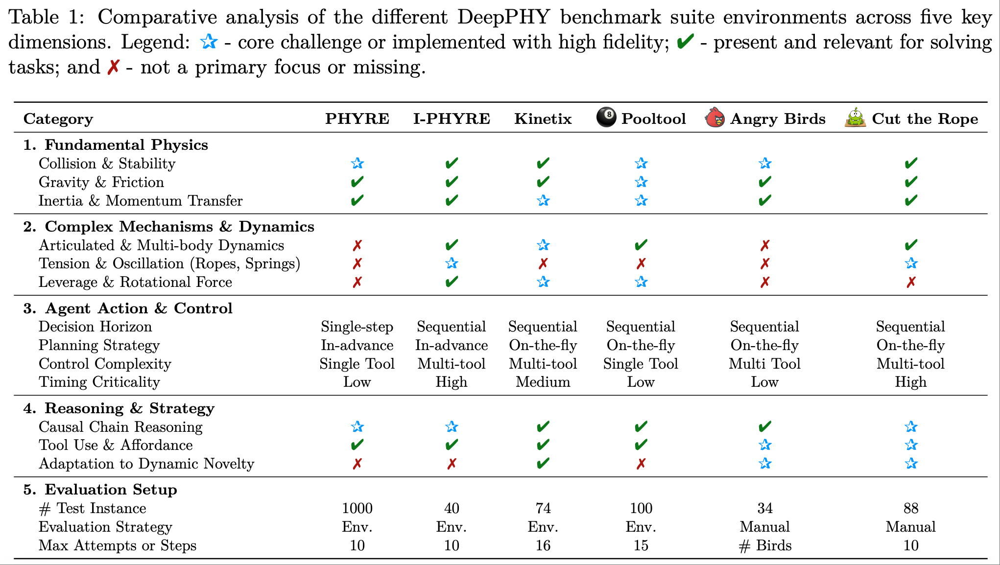

# DeepPHY: Benchmarking Agentic VLMs on Physical Reasoning


[](https://arxiv.org/abs/2508.05405)


DeepPHY is a novel benchmark framework designed to systematically evaluate the ability of Vision-Language Models (VLMs) to understand and reason about fundamental physical principles through a series of challenging simulated environments.

## The DeepPHY Benchmark Suite


DeepPHY integrates six diverse and challenging environments to evaluate interactive physical reasoning in agentic VLMs. Our results indicate that even state-of-the-art models have significant performance gaps to address.

## Core Contributions

*   **A Novel Benchmark Suite:** We introduce **DeepPHY**, the first comprehensive benchmark suite to systematically evaluate interactive physical reasoning in agentic VLMs.
*   **Unified Framework:** We develop a unified framework and standardized metrics that transform diverse physics simulators into a rigorous and accessible testbed for evaluating VLMs.
*   **Extensive Empirical Study:** We conduct an extensive study of leading open- and closed-source VLMs, providing clear baselines and revealing their limitations in physical interaction, planning, and adaptation.

## Environment Overview

DeepPHY systematically integrates six challenging physics-based simulation environments. The table below provides a comparative analysis across five key dimensions.



## Installation

### 1. Clone the Repository
```bash
git clone https://github.com/XXX/DeepPHY.git
cd DeepPHY
```

### 2. Setup Environment and Dependencies
We recommend using Python `3.10`.
```bash
pip install -r requirements_py310.txt
```
**Environment-Specific Setups:**
*   **PHYRE:** This environment requires `python=3.9` and is only supported on Linux.
    ```bash
    # Create a separate conda environment if needed
    conda create -n phyre python=3.9
    conda activate phyre
    pip install -r requirements_py39.txt
    ```
*   **I-PHYRE:** After installing `requirements_py310.txt`, please replace the file at `.conda/envs/iphyre/lib/python3.10/site-packages/iphyre/simulator.py` with our provided version at `res/02_iphyre/simulator.py`. This step is necessary to generate the annotated images.

*   **Angry Birds:** Please go to the [Download link](https://apps.apple.com/us/app/rovio-classics-angry-birds/id1596736236) to install the Angry Birds game on an iPhone. The evaluation is conducted by mirroring the iPhone's screen to a Mac.

*   **Cut the Rope:** Please go to the [Download link](https://apps.apple.com/cn/app/cut-the-rope/id1024507512) to install the Cut the Rope game on a Mac to conduct the evaluation.


### 3. Configure API Keys
Create a `.env` file in the root directory and add your API keys.
```env
# For OpenAI Models (GPT series)
API_URL="XXX"
API_KEY="XXX"

# For QWEN Models (if you download the Qwen-7B model locally)
QWEN_MODEL_7B_PATH="XXX/Qwen2.5-VL-7B-Instruct"
```

## Running Evaluations
We provide evaluation scripts for each environment. Before running, ensure you have configured your API keys correctly.

```bash
# Evaluate on PHYRE
bash scripts/01_phyre_eval.sh

# Evaluate on I-PHYRE
bash scripts/02_iphyre_eval.sh

# Evaluate on Kinetix
bash scripts/03_kinetix_eval.sh

# Evaluate on Pooltool
bash scripts/04_pooltool_eval.sh

# Evaluate on Angry Birds
bash scripts/05_angrybirds_eval.sh

# Evaluate on Cut the Rope
bash scripts/06_cutrope_eval.sh
```
You can modify the `MODELS`, `PROMPT_FORMATS`, and other parameters inside these scripts to customize your evaluation runs.


## Key Results
Our experiments show that even SOTA VLMs struggle with interactive physical reasoning, revealing a significant gap between their descriptive knowledge and predictive control capabilities.

## Citation

```bibtex
@inproceedings{aaai-xu2025deepphy,
    author = {Xu, Xinrun and Bu, Pi and Wang, Ye and Karlsson, B{\"o}rje F. and Wang, Ziming and Song, Tengtao and Zhu, Qi and Song, Jun and Ding, Zhiming and Zheng, Bo},
    title = {{DeepPHY: Benchmarking Agentic VLMs on Physical Reasoning}},
    booktitle = {Proceedings of the 40th Annual AAAI Conference on Artificial Intelligence (AAAI-26)},
    year = 2026
}

@article{xu2025deepphy,
  title={{DeepPHY: Benchmarking Agentic VLMs on Physical Reasoning}},
  author={Xu, Xinrun and Bu, Pi and Wang, Ye and Karlsson, B{\"o}rje F. and Wang, Ziming and Song, Tengtao and Zhu, Qi and Song, Jun and Ding, Zhiming and Zheng, Bo},
  journal={arXiv preprint arXiv:2508.05405},
  year={2025}
}
```

## Acknowledgements
We would like to thank the creators of the original environments that form the basis of our benchmark:
*   [PHYRE](https://github.com/facebookresearch/phyre)
*   [I-PHYRE](https://github.com/lishiqianhugh/IPHYRE)
*   [Kinetix](https://github.com/FLAIROx/Kinetix)
*   [Pooltool](https://github.com/ekiefl/pooltool)
*   [Angry Birds (Rovio Entertainment)](https://apps.apple.com/us/app/rovio-classics-angry-birds/id1596736236)
*   [Cut the Rope (ZeptoLab)](https://apps.apple.com/cn/app/cut-the-rope/id1024507512)
*   [Cradle](https://github.com/BAAI-Agents/Cradle)
